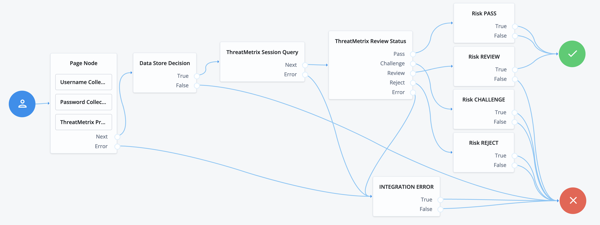

# LexisNexis ThreatMetrix Authentication Nodes

---

The LexisNexis ThreatMetrix authentication nodes lets administrators integrate Deveice Intelligence
and Risk Assessment into a ForgeRock Authentication Tree. From the LexisNexis ThreatMetrix Portal, the
configured policy for risk assessment will orchestrate LexisNexis products such as ThreatMetrix, Emailage, 
PhoneFinder, InstantID and FlexID.  When a transaction occurs, such as a login event, the LexisNexis 
ThreatMetrix nodes will be integated for risk assessment resulting in a risk score that is interpretted
to define outcomes such as step-up authentication, passing without further friction, or rejecting 
resulting in blocking the transaction.

## Usage
To either upgrade or newly deploy these nodes, perform the following:
- Download the jar from the releases tab on github [here](https://github.com/ForgeRock/ThreatMetrix-Auth-Nodes/releases/tag/1.1.0). 
- Copy the jar into the `../web-container/webapps/openam/WEB-INF/lib` directory where AM is 
deployed
- Restart the web container to pick up the new nodes
- Once restart is complete, the nodes will then appear in the authentication trees components palette.

## Backwards Compatibility
Nodes have been tested to be backwards compatible with upgrading from version 1.1.0 to 1.2.0 on ForgeRock AM v7.1.2 and ForgeRock AM v7.2.0

## Quick Start Guide
In order to get started with the LexisNexis ThreatMetrix Nodes, we have prepared a Quick Start Guide that contains steps to install and configure a standalone ForgeRock AM server with ThreatMetrix Nodes. The Getting Started guide will assist a developer to install the capabilities on a local laptop. Click [Here](./docs/FGRK-Getting-Started-Guide.pdf) to download a copy of the quick start guide.

# Node Overview

---

LexisNexis ThreatMetrix provides the following ForgeRock Nodes
- ThreatMetrix Profiler
- ThreatMetrix Query
- ThreatMetrix Review Status
- ThreatMetrix Reason Code
- ThreatMetrix Update Status

For more information with respect to the parameters in each of the nodes described below, refer to the online Knowledge Base (KB) available via the [ThreatMetrix Portal](https://portal.threatmetrix.com).

## ThreatMetrix Profiler Node
This node will integrate the ThreatMetrix device intelligence and fingerprinting JavaScript tags.js onto a ForgeRock Page Node. This is typically placed onto a Login Page, Payment Page, or Account Creation page as part of a risk assessment use case.

The ThreatMetrix Profiler node has the following configuration parameters:
* **Org ID** - Org ID is the unique id associated with ThreatMetrix generated for your organization.
* **Page ID** - The Page ID is an identifier to be used if you place the ThreatMetrix tag on multiple pages.
* **Profiler URI** - ThreatMetrix Profiler URI. This can be the Basic Profiling URL or the Enhanced Profiling vis Hosted SSL URL. The default configuration is the Basic Profiling URL.
* **Use Client Generated Session IDs** - If the ThreatMetrix Javascript is separately integrated into the application
 from the ForgeRock XUI, then enable this property to be able to pass the ThreatMetrix Session ID from the client
  side via the <code>HiddenValueCallback</code>.

## ThreatMetrix Query Node
This node makes a request LexisNexis ThreatMetrix API Request to either: (i) Session Query API, or (ii) Attribute Query API.  The main difference is that Session Query API requires the TMX Profiler Node to perform device intelligence, whereas the Attribute Query does not involve device intelligence.  Attribute query is helpful in situations where a LexisNexis product such as Emailage or InstantID can be invoked for a risk assessment without any device intelligence.

The ThreatMetrix Query Node has the following configuration parameters:
* **Org ID** - Org ID is the unique id associated with ThreatMetrix generated for your organization.
* **API Key** - This is the unique API key generated by ThreatMetrix associated to the Org ID.
* **Service Type** - Defines the API Response output fields returned from the API Request. The default configuration is session-policy. See the ThreatMetrix Portal KB for a full list of service types.
* **Event Type** - Specifies the type of transaction or event. The default configuration is login. See the ThreatMetrix Portal KB for a full list of event types.
* **Policy** - The policy to be used for the query. 
* **API Error Action** - If an API error is encountered (e.g. network error, timeouts, invalid parameters), then the configured action will be followed as the outcome. This allows the system administrator to define the behavior in the unlikely event this occurs at runtime.
* **Unknown Session Action** - If an "unknown session" is encountered at runtime, this allows the system administrator to define the behavior in the unlikely event this occurs at runtime. Unknwon sessions occur for a variety of reasons where the device profiling has failed. 
* **Query Type** - Defines the query type to send to ThreatMetrix. Session Query requires device profile inforamtion and Attribute Query does not require device profile information.
* **Session Query URI** - ThreatMetrix Session Query URI.This is used when the **Query Type** is set to Session Query, otherwise ignored.
* **Attribute Query URI** - ThreatMetrix Attribute Query URI. This is used when the **Query Type** is set to Attribute Query, otherwise ignored.
* **Add Shared State Variables To Request** - If you'd like to add additional parameters to the ThreatMetrix API Request, enable this option. In general it is preferred to add as much data as possible to the API Requests as this will improve the fidelity of the risk assessment.
* **Session Query Parameters** -  This is a list of ThreatMetrix attribute "key" to ForgeRock "value" attributes. The ForgeRock values are read from the authenticated user identity store.

## ThreatMetrix Review Status Node
This node analyzes the response from the ThreatMetrix Query Node and routes based on the API Response <code>review_status</code>.  The possible outcomes to route are <code>Pass</code>, <code>Challenge</code>, <code>Review</code> or <code>Reject</code> node outcomes.  Any errors encountered by the ThreatMetrix Query Node will follow either the Unknown Session Action, or the API Error Action configuration for outcome.
 
## ThreatMetrix Reason Code Node
This node analyzes the response from the ThreatMetrix Query Node and routes based on the API Response <code>reason_code</code>. The reason codes are required to be configured so that appropriate outcome routing can occur. The reason codes corresopnd to the ThreatMetrix Portal policy configuration for possible outcomes. Reason codes are generally utilized when the 4 default outcomes for review status are not sufficient for branching in the ForegeRock authentication tree.
 
The outcomes configured for API Error Action and Unknown Session Action do need to be configured in the list of outcomes, otherwise the default <code>Failure</code> outcome will be utilized.

The ThreatMetrix Reason Code Node has the following configuration parameters:
* **Reason Code Outcomes** - A list of Reason Codes that to check from a Query API Response. When a Reason Code is added to this list, a new outcome will presented on the node. The node will iterate through the configured Reason Code list until a Reason code match is found and will return that outcome. Otherwise, the <code>None Triggered</code> outcome will be returned. Reason Code outcomes are case sensitive and must match the ThreatMetrix Portal policy.
 
## ThreatMetrix Update Review Node
The ThreatMetrix Update Node provides retrospective trusth data to ThreatMetrix for an event. The typical ForgeRock Authentication Tree will perform a ThreatMetrix Query and if step-up authentication is involved, the ThreatMetrix Update Node is integrated to provide additional details on the event. Truth data is incredibly beneficial for tuning of the policy and overall fraud detection.

The ThreatMetrix Reason Code Node has the following configuration parameters:
* **Org ID** - Org ID is the unique id associated with ThreatMetrix generated for your organization.
* **API Key** - This is the unique API key generated by ThreatMetrix associated to the Org ID.
* **Update URI** - ThreatMetrix Update URI.
* **API Error Action** - If an API error is encountered (e.g. network error, timeouts, invalid parameters), then the configured action will be followed as the outcome. This allows the system administrator to define the behavior in the unlikely event this occurs at runtime.
* **Event Tag** - This represents the event disposition and outcome of the ThreatMetrix Query. Generally, the <code>challenge_init</code> is configured prior to sending a Step-Up authentication request in the event the transaction is abandoned. Following a step-up authentication, either <code>challenge_pass</code> or <code>challenge_fail</code> is sent to the ThreatMetrix platform.
* **Step-Up Method** - This is the authentication challenge method used within the ForgeRock authentication tree to report retrospective truth data for the overall transaction. 
* **Notes** - An optional notes parameter that allows you to append any notes such as why the review status is being updated.

# Example Authentication Tree Flow
 

