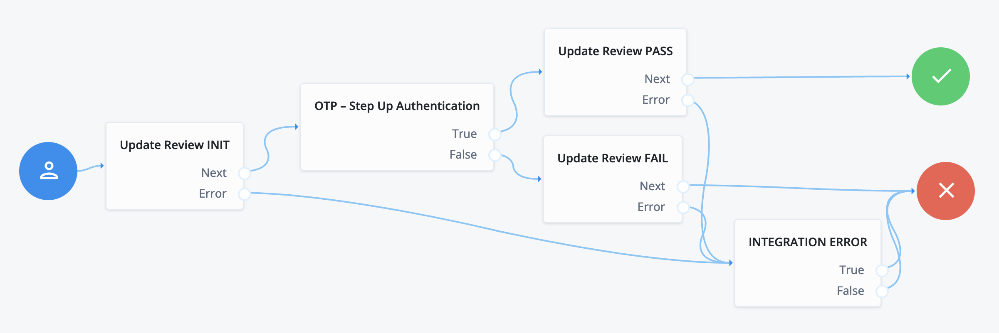

# LexisNexis ThreatMetrix Authentication Nodes
The LexisNexis ThreatMetrix Authentication Nodes provides the capability for administrators to integrate 
Device Intelligence and Risk Assessment into a ForgeRock Authentication Tree. From the LexisNexis 
ThreatMetrix Portal, the configured policy for risk assessment will orchestrate LexisNexis products 
such as ThreatMetrix, Emailage, PhoneFinder, InstantID and FlexID.  When a transaction occurs, such as 
a login event, the LexisNexis ThreatMetrix nodes will be integrated for risk assessment resulting in a 
risk score mapped to defined outcomes such as step-up authentication, passing without further friction, 
or rejecting resulting in blocking the transaction.

## Installation
LexisNexis ThreatMetrix Authentication Nodes are packaged as a jar file using the maven build toolset. To 
deploy the jar file for the nodes, perform the following:
- Download the jar from the releases tab on github [here](https://github.com/ForgeRock/ThreatMetrix-Auth-Nodes/releases/latest). 
- Stop the web container to deploy the jar file
- Copy the jar into the `../web-container/webapps/openam/WEB-INF/lib` directory where AM is deployed
- Restart the web container to pick up the new nodes
- Once restart is complete, the nodes will then appear in the authentication trees components palette.

## Backwards Compatibility
The LexisNexis ThreatMetrix Nodes have been tested to be compatible with ForgeRock AM v7.3.0, as well as 
available on the ForgeRock Identity Cloud.  

Due to changes in the APIs, the LexisNexis ThreatMetrix Nodes v1.2.0 are not compatible with versions 
prior to ForgeRock v7.3.0. If support is needed for these versions, contact LexisNexis.

## Quick Start Guide
In order to get started with the LexisNexis ThreatMetrix Nodes, we have prepared a Quick Start Guide for LexisNexis ThreatMetrix Nodes. 
- Click [here](./docs/FGRK-LNRS-TMX-AuthNodes-Getting-Started-Guide-Cloud.pdf) to download a copy of the quick start guide for the ForgeRock Identity Cloud. 
- Click [here](./docs/FGRK-LNRS-TMX-AuthNodes-Getting-Started-Guide-OpenAM.pdf) to download a copy of the quick start guide for the ForgeRock Access Manager.

## Release Notes
To get the latest version of the LexisNexis ThreatMetrix Nodes release notes, click [here](./docs/FGRK-LNRS-TMX-AuthNodes-Release-Notes.pdf) 

# Node Overview

LexisNexis ThreatMetrix provides the following ForgeRock Nodes
- ThreatMetrix Profiler
- ThreatMetrix Query
- ThreatMetrix Review Status
- ThreatMetrix Reason Code
- ThreatMetrix Update Status

## ThreatMetrix Profiler Node
This node will integrate the ThreatMetrix device intelligence and fingerprinting JavaScript Tags onto a ForgeRock Page Node. This is typically placed onto a Login Page, Payment Page, or Account Creation page as part of a risk assessment use case.

The ThreatMetrix Profiler node has the following configuration parameters:
* **Org ID** - Org ID is the unique id associated with ThreatMetrix generated for your organization.
* **Page ID** - The Page ID is an identifier to be used if you place the ThreatMetrix tag on multiple pages.
* **Profiler URI** - ThreatMetrix Profiler URI. This can be the Basic Profiling URL or the Enhanced Profiling vis Hosted SSL URL. The default configuration is the Basic Profiling URL.
* **Use Client Generated Session IDs** - If ThreatMetrix JavaScript Tags have been separately integrated onto an application webpage 
external to the ForgeRock platform, activate this property toggle. When activated, this node will fetch the SessionID from the 
application via a ForgeRock Read-Only callback, mainly a <code>HiddenValueCallback</code>.

## ThreatMetrix Query Node
This node makes a request LexisNexis ThreatMetrix API Request to either: (i) Session Query API, or (ii) Attribute Query API.  The main difference is that Session Query API requires the TMX Profiler Node to perform device intelligence, whereas the Attribute Query does not involve device intelligence.  Attribute query is helpful in situations where a LexisNexis product such as Emailage or InstantID can be invoked for a risk assessment without any device intelligence.

The ThreatMetrix Query Node has the following configuration parameters:
* **Org ID** - Org ID is the unique id associated with ThreatMetrix generated for your organization.
* **API Key** - This is the unique API key generated by ThreatMetrix associated to the Org ID.
* **Service Type** - Defines the API Response output fields returned from the API Request. The default configuration is session-policy. See the ThreatMetrix Portal KB for a full list of service types.
* **Event Type** - Specifies the type of transaction or event. The default configuration is login. See the ThreatMetrix Portal KB for a full list of event types.
* **Policy** - The policy to be used for the query. 
* **Unknown Session Action** - If an "unknown session" is encountered at runtime, this allows the system administrator to define the behavior in the unlikely event this occurs at runtime. Unknwon sessions occur for a variety of reasons where the device profiling has failed. 
* **Query Type** - Defines the query type to send to ThreatMetrix. Session Query requires device profile inforamtion and Attribute Query does not require device profile information.
* **Session Query URI** - ThreatMetrix Session Query URI.This is used when the **Query Type** is set to Session Query, otherwise ignored.
* **Attribute Query URI** - ThreatMetrix Attribute Query URI. This is used when the **Query Type** is set to Attribute Query, otherwise ignored.
* **Add Shared State Variables To Request** - If you'd like to add additional parameters to the ThreatMetrix API Request, enable this option. In general it is preferred to add as much data as possible to the API Requests as this will improve the fidelity of the risk assessment.
* **Session Query Parameters** -  This is a list of ThreatMetrix attribute "key" to ForgeRock "value" attributes. The ForgeRock values are read from the authenticated user identity store.

## ThreatMetrix Review Status Node
This node analyzes the response from the ThreatMetrix Query Node and routes based on the API Response <code>review_status</code>.  The possible outcomes to route are <code>Pass</code>, <code>Challenge</code>, <code>Review</code> or <code>Reject</code> node outcomes. If an unknown session occurred as a result of profiling and the ThreatMetrix query reported unknown session condition, the ThreatMetrix Review Status Node will follow the configured Unknown Session Action.
 
## ThreatMetrix Reason Code Node
This node analyzes the response from the ThreatMetrix Query Node and routes based on the API Response <code>reason_code</code>. The reason codes are required to be configured so that appropriate outcome routing can occur. The reason codes corresopnd to the ThreatMetrix Portal policy configuration for possible outcomes. Reason codes are generally utilized when the 4 default outcomes for review status are not sufficient for branching in the ForegeRock authentication tree.
 
The outcome for Unknown Session Action does need to be configured in the list of outcomes, otherwise the default
<code>Error</code> outcome will be utilized.

The ThreatMetrix Reason Code Node has the following configuration parameters:
* **Reason Code Outcomes** - A list of Reason Codes that to check from a Query API Response. When a Reason Code is added to this list, a new outcome will presented on the node. The node will iterate through the configured Reason Code list until a Reason code match is found and will return that outcome. Otherwise, the <code>None Triggered</code> outcome will be returned. Reason Code outcomes are case sensitive and must match the ThreatMetrix Portal policy.
 
## ThreatMetrix Update Review Node
The ThreatMetrix Update Node provides retrospective trusth data to ThreatMetrix for an event. The typical ForgeRock Authentication Tree will perform a ThreatMetrix Query and if step-up authentication is involved, the ThreatMetrix Update Node is integrated to provide additional details on the event. Truth data is incredibly beneficial for tuning of the policy and overall fraud detection.

The ThreatMetrix Update Review Node has the following configuration parameters:
* **Org ID** - Org ID is the unique id associated with ThreatMetrix generated for your organization.
* **API Key** - This is the unique API key generated by ThreatMetrix associated to the Org ID.
* **Update URI** - ThreatMetrix Update URI.
* **Event Tag** - This represents the event disposition and outcome of the ThreatMetrix Query. Generally, the <code>challenge_init</code> is configured prior to sending a Step-Up authentication request in the event the transaction is abandoned. Following a step-up authentication, either <code>challenge_pass</code> or <code>challenge_fail</code> is sent to the ThreatMetrix platform.
* **Step-Up Method** - This is the authentication challenge method used within the ForgeRock authentication tree to report retrospective truth data for the overall transaction. 
* **Notes** - An optional notes parameter that allows you to append any notes such as why the review status is being updated.

# Configuring LexisNexis ThreatMetrix Auth Tree

## Example Journey/Tree
The example depicted here is showing how to integrate LexisNexis ThreatMetrix into a Login journey. The journey starts with a Page node to capture username/password at the same time the ThreatMetrix Profiler node injects JavaScript Tags into the page to capture device intelligence information, where the device information is associated to a unique Session ID. The Session ID along with user PII make up an API call via the ThreatMetrix Session Query Node to the LexisNexis Dynamic Decision Platform (DDP) for risk assessment. Risk assessment is performed via a DDP policy to run the rules associated to the login event and associated PII data to capture suspicious activity. The result of the risk assessment is captured as a API response in the ThreatMetrix Session Query node. This particular example shows the ThreatMetrix Review Status node being used to interpret the API risk assessment response, where this node interprets the <code>review_status</code>. The possible outcomes to continue the journey are <code>Pass</code>, <code>Challenge</code>, <code>Review</code> or <code>Reject</code>.  The outcomes <code>Challenge</code> and <code>Review</code> start a step-up second factor of authentication, which can be any set of nodes to perform this capability, such as OTP/SMS or Mobile push notification. Regardless of the step-up authentication, the ThreatMetrix Update Review node adds truth data to the login event which enriches the information in the network and enhance fraud detection. The example here shows initialization of step-up MFA along with outcome of either pass or fail. The initialization is important as step-up authentication that is initialized but never completes is a sign of potential fraud with a login event.
 

## Example Journey/Tree

The example depicted here shows a ForgeRock journey with LexisNexis ThreatMetrix nodes from the marketplace, specifically a One-Time Passcode (OTP) integration with ThreatMetrix retrospective truth data via the ThreatMetrix Update Review nodes. The truth data is an essential part of the risk engine that improves the fidelity of risk assessments over time. The journey depicted here is meant to be called from a ForgeRock Inner Tree Evaluator node from another journey that has the ThreatMetrix risk assessment, such as the previous exmaple depiction. The shared state is assumed to have the request_id from the risk assessment result which is used to link together the ThreatMetrix Update Review for retrospective truth data to the risk event.

