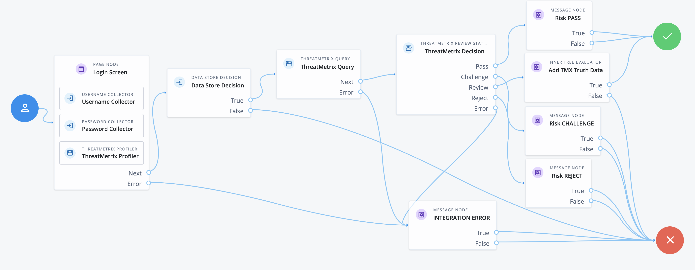
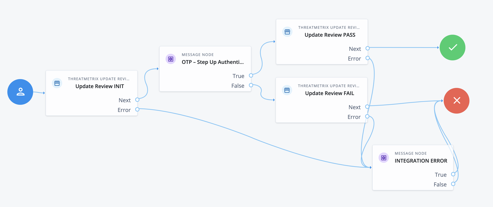

# LexisNexis ThreatMetrix Nodes
---
LexisNexis ThreatMetrix® Nodes provide the capability for administrators to integrate advanced risk assessment capability through integration with the LexisNexis Risk Solutions (LNRS) Dynamic Decision Platform (DDP) / ThreatMetrix (TMX) product. The nodes are available for both PingOne Advanced Identity Cloud (PingOne AIC), formerly ForgeRock Identity Cloud, and Ping Access Management (PingAM), formerly ForgeRock Access Management. 

The nodes provide production ready connectivity and orchestration of all LexisNexis products to include ThreatMetrix, BehavioSec, Emailage, PhoneFinder, InstantID, FlexID and more. The nodes also support a wide variety of use cases to include login, password change, account creation, and payment to name a few. When the nodes are integrated, the risk assessment policy hosted within the LexisNexis DDP/TMX cloud returns a risk score mapped to defined outcomes such as step-up authentication, passing without further friction, or rejecting resulting in blocking the transaction.
 
## Installation
For the on-premise PingAM / ForgeRock, LexisNexis ThreatMetrix Nodes are packaged as a jar file that is to be installed within the web server. To deploy the jar file, perform the following:
- Download the jar from the releases tab on github [here](https://github.com/ForgeRock/ThreatMetrix-Auth-Nodes/releases/latest). 
- Stop the web container to deploy the jar file
- Copy the jar into the `../web-container/webapps/openam/WEB-INF/lib` directory where PingAM / ForgeRock is deployed
- Restart the web container to pick up the new nodes
- Once restart is complete, the nodes will then appear in the authentication trees components palette.

## Backwards Compatibility
The LexisNexis ThreatMetrix Nodes have been tested with PingAM / ForgeRock v8.0, with backwards compatibility to v7.3, v7.4 and v7.5. Due to changes in the APIs, the LexisNexis ThreatMetrix Nodes are not compatible with versions prior to v7.3. If support is needed for these versions, contact LexisNexis Risk Solutions.

## Quick Start Guide
In order to get started with the LexisNexis ThreatMetrix Nodes, we have prepared Quick Start Guides: 
- Click [here](./docs/LNRS-TMX-Nodes-Getting-Started-Guide-Cloud.pdf) to download a copy of the quick start guide for PingOne AIC / ForgeRock. 
- Click [here](./docs/LNRS-TMX-Nodes-Getting-Started-Guide-OpenAM.pdf) to download a copy of the quick start guide for PingAM / ForgeRock.

## Release Notes
To get the latest version of the LexisNexis ThreatMetrix Nodes release notes, click [here](./docs/LNRS-TMX-Nodes-Release-Notes.pdf) 

# Node Overview
---
LexisNexis ThreatMetrix provides the following nodes:
- ThreatMetrix Profiler
- ThreatMetrix Query
- ThreatMetrix Review Status
- ThreatMetrix Reason Code
- ThreatMetrix Update Status

## ThreatMetrix Profiler Node
This node will integrate the ThreatMetrix device intelligence and fingerprinting JavaScript Tags onto a ForgeRock Page Node. This is typically placed onto a Login Page, Payment Page, or Account Creation page as part of a risk assessment use case.

The ThreatMetrix Profiler node has the following configuration parameters:
* **Org ID** - Org ID is the unique id associated with DDP/TMX generated for your organization.
* **Page ID** - The Page ID is an identifier to be used if you place the profiling on multiple page nodes. This is an optional parameter and can be left blank.
* **Profiler URI** - ThreatMetrix Profiler URI. This can be the Basic Profiling URL or the Enhanced Profiling vis Hosted SSL URL. The default configuration is the Basic Profiling URL for the global region.
* **Use Client Generated Session IDs** - If ThreatMetrix JavaScript Tags have been separately integrated onto an customer hosted webpage or mobile device, this configuration allows for sending the unique Session ID to Ping AIC / ForgeRock through <code>HiddenValueCallback</code> as part of an API Request.

## ThreatMetrix Query Node
This node makes a request LexisNexis ThreatMetrix API Request to either: (i) Session Query API, or (ii) Attribute Query API.  The main difference is that Session Query API requires the TMX Profiler Node to perform device intelligence, whereas the Attribute Query does not involve device intelligence.  Attribute query is helpful in situations where a LexisNexis product such as Emailage or InstantID can be invoked for a risk assessment without any device intelligence.

The ThreatMetrix Query Node has the following configuration parameters:
* **Org ID** - Org ID is the unique id associated with DDP/TMX generated for your organization.
* **API Key** - This is the unique API key generated by DDP/TMX associated to the Org ID.
* **Service Type** - Defines the API Response output fields returned from the API Request. The default configuration is session-policy. See the DDP/TMX Knowledge Base (KB) for a full list of service types.
* **Event Type** - Specifies the type of transaction or event. The default configuration is login. See the DDP/TMX KB for a full list of event types.
* **Policy** - The policy to be used for the query. The policy is configured in the DDP/TMX Portal which is a set of decision policy rules that together generate the risk assessment policy score and outcome. 
* **Unknown Session Action** - If an "unknown session" is encountered at runtime, this allows the system administrator to define the behavior in the unlikely event this occurs at runtime. Unknown sessions occur for a variety of reasons where the device profiling has failed. 
* **Query Type** - Defines the query type to send as the DDP/TMX API Request.  Session Query requires device intelligence to be collected previously by the Profiler Node and Attribute Query does not require device profile information.
* **Base URL** - Defines the domain URL for the DDP/TMX region where API Requests are to be sent.  The default value is the global region.
* **Add Attributes to API Request** - If you'd like to add additional parameters to the DDP/TMX API Request, enable this option. In general, it is preferred to add as much data as possible to the API Requests as this will improve the fidelity of the risk assessment.
* **Attribute Source** - Defines where additional attributes (if configured) are to be fetched at runtime. This is a dropdown list that contains the options User Directory and Shared State. User Directory will look for attributes in the Identity Store, and Shared State looks in the shared memory of the authentication tree/journey.
* **Query Attributes** -  This is a list of DDP/TMX attributes (e.g. "key") to authentication journey attributes (e.g. "value"). The Attribute Source configuration defines where the values will be fetched. If the values cannot be fetched, the API Request will not include the DDP/TMX attribute.

## ThreatMetrix Review Status Node
This node analyzes the response from the ThreatMetrix Query Node and routes based on the API Response <code>review_status</code>.  The possible outcomes to route are <code>Pass</code>, <code>Challenge</code>, <code>Review</code> or <code>Reject</code> node outcomes. If an unknown session occurred as a result of profiling and the ThreatMetrix query reported unknown session condition, the ThreatMetrix Review Status Node will follow the configured Unknown Session Action as defined in the ThreatMetrix Query Node.
 
## ThreatMetrix Reason Code Node
This node analyzes the response from the ThreatMetrix Query Node and routes based on the API Response <code>reason_code</code>. The reason codes are required to be configured so that appropriate outcome routing can occur. The reason codes corresopnd to the DDP/TMX Portal policy configuration for possible outcomes. Reason codes are generally utilized when the 4 default outcomes for review status are not sufficient for branching in the ForegeRock authentication tree.
 
The outcome for Unknown Session Action does need to be configured in the list of outcomes, otherwise the default
<code>Error</code> outcome will be utilized.

The ThreatMetrix Reason Code Node has the following configuration parameters:
* **Reason Code Outcomes** - A list of Reason Codes that to check from a Query API Response. When a Reason Code is added to this list, a new outcome will presented on the node. The node will iterate through the configured Reason Code list until a Reason code match is found and will return that outcome. Otherwise, the <code>None Triggered</code> outcome will be returned. Reason Code outcomes are case sensitive and must match the DDP/TMX Portal policy.
 
## ThreatMetrix Update Review Node
The ThreatMetrix Update Node provides retrospective trusth data to ThreatMetrix for an event. The typical authentication tree/journey will perform a ThreatMetrix Query and if step-up authentication is involved, the ThreatMetrix Update Node is integrated to provide additional details on the event. Truth data is incredibly beneficial for tuning of the policy and overall fraud detection.

The ThreatMetrix Update Review Node has the following configuration parameters:
* **Org ID** - Org ID is the unique id associated with TMX/DDP generated for your organization.
* **API Key** - This is the unique API key generated by TMX/DDP associated to the Org ID.
* **Base URL** - Defines the domain URL for the DDP/TMX region where API Requests are to be sent.  The default value is the global region.
* **Event Tag** - This represents the event disposition and outcome of the ThreatMetrix Query. Generally, the <code>challenge_init</code> is configured prior to sending a Step-Up authentication request in the event the transaction is abandoned. Following a step-up authentication, either <code>challenge_pass</code> or <code>challenge_fail</code> is sent to the ThreatMetrix platform.
* **Step-Up Method** - This is the authentication challenge method used within the ForgeRock authentication tree to report retrospective truth data for the overall transaction. 
* **Notes** - An optional notes parameter that allows you to append any notes such as why the review status is being updated.

# Configuring LexisNexis ThreatMetrix Auth Tree
---
## Example Journey/Tree
The example depicted here is showing how to integrate LexisNexis ThreatMetrix into a Login journey. The journey starts with a Page node to capture username/password at the same time the ThreatMetrix Profiler node injects JavaScript Tags into the page to capture device intelligence information, where the device information is associated to a unique Session ID. The Session ID along with user personally Identifiable Information (PII) make up an API request via the ThreatMetrix Query Node to the LexisNexis Dynamic Decision Platform (DDP) for risk assessment. Risk assessment is performed via a DDP/TMX Portal policy to run the rules associated to the login event and associated PII data to capture suspicious activity. The result of the risk assessment is captured as a API response. This particular example shows the ThreatMetrix Review Status node being used to process the results contained within the API response, in particular the node interprets the <code>review_status</code> attribute. The possible outcomes to continue the journey are <code>Pass</code>, <code>Challenge</code>, <code>Review</code> or <code>Reject</code>. In the example depicted below the outcome <code>Review</code> is connected to an inner tree evaluator node that is configured to initiate a second factor of authentication, which in the example is one-time passcode (OTP). Using an inner tree node allows the integration to be flexible over time for new forms of second factor authentication.

For more information on how to configure the example journey, refer to the Quick Start guides.
 

## Example Journey/Tree

The example depicted here showing how to integate LexisNexis ThreatMetrix nodes, specifically a One-Time Passcode (OTP) integration with ThreatMetrix retrospective truth data via the ThreatMetrix Update Review nodes. The truth data is an essential part of the risk engine that improves the fidelity of risk assessments over time. The journey depicted here is meant to be called from an inner tree evaluator node from another journey that has the ThreatMetrix risk assessment, such as the previous exmaple depiction. The shared state is assumed to have the <code>request_id</code>code> from the risk assessment result which is used to link together the ThreatMetrix Update Review for retrospective truth data to the risk event API response from the ThreatMetrix Query node.

For more information on how to configure the example journey, refer to the Quick Start guides.

