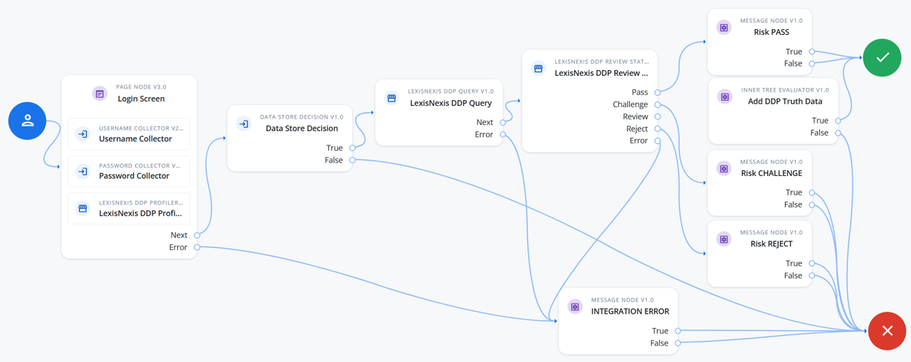
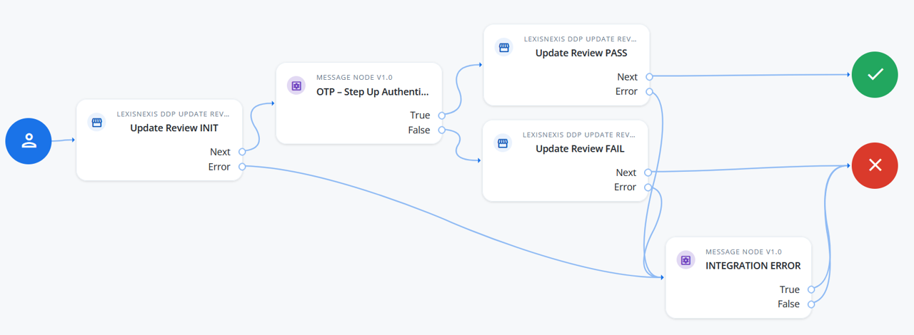

# LexisNexis Dynamic Decision Platform (DDP) Nodes
---
LexisNexis® Dynamic Decision Platform (DDP) unifies the key components of fraud prevention into a single, holistic risk decision platform. DDP connects multiple data sources and intelligence signals, enabling real-time orchestration of risk decisions. By integrating multi-signal insights, custom attributes and AI-enabled models, the platform delivers faster, more accurate outcomes while reducing operational complexity.

LexisNexis Dynamic Decision Platform (DDP) nodes are available for both PingOne Advanced Identity Cloud (PingOne AIC), formerly ForgeRock Identity Cloud, and Ping Access Management (PingAM), formerly ForgeRock Access Management. The nodes provide production ready connectivity and orchestration of all LexisNexis products to include ThreatMetrix, BehavioSec, Emailage, PhoneFinder, InstantID, FlexID and more. The nodes also support a wide variety of use cases to include login, password change, account creation, and payment to name a few. When the nodes are integrated, the risk assessment policy hosted within the LexisNexis DDP cloud returns a risk score mapped to defined outcomes such as step-up authentication, passing without further friction, or rejecting resulting in blocking the transaction.

## Installation
For the on-premise PingAM / ForgeRock, LexisNexis DDP Nodes are packaged as a jar file that is to be installed within the web server. To deploy the jar file, perform the following:
- Download the jar from the releases tab on github [here](https://github.com/ForgeRock/ThreatMetrix-Auth-Nodes/releases/latest). 
- Stop the web container to deploy the jar file
- Copy the jar into the `../web-container/webapps/openam/WEB-INF/lib` directory where PingAM / ForgeRock is deployed
- Restart the web container to pick up the new nodes
- Once restart is complete, the nodes will then appear in the authentication trees components palette.

## Compatibility

<table>
  <colgroup>
    <col>
    <col>
  </colgroup>
  <thead>
  <tr>
    <th>Product</th>
    <th>Compatible?</th>
  </tr>
  </thead>
  <tbody>
  <tr>
    <td>
Ping Advanced Identity Cloud (PingAIC)
</td>
    <td>
Yes
</td>
  </tr>
  <tr>
    <td>
Ping Access Management (PingAM) (self-managed)
</td>
    <td>
Yes
</td>
  </tr>
  </tbody>
</table>

## Backwards Compatibility
The LexisNexis DDP Nodes have been tested with PingAM / ForgeRock v8.0, with backwards compatibility to v7.3, v7.4 and v7.5. Due to changes in the PingAM / ForgeRock APIs, the LexisNexis DDP Nodes are not compatible with versions prior to v7.3. 

Due to differences in compatibility between PingAM v7.x and PingAM v8.x, there are two different distribution media jar files for the LexisNexis DDP nodes.

## Quick Start Guide
In order to get started with the LexisNexis DDP Nodes, we have prepared Quick Start Guides: 
- Click [here](./docs/LNRS-DDP-Nodes-Getting-Started-Guide-PingAIC.pdf) to download a copy of the quick start guide for PingOne AIC / ForgeRock. 
- Click [here](./docs/LNRS-DDP-Nodes-Getting-Started-Guide-PingAM.pdf) to download a copy of the quick start guide for PingAM / ForgeRock.

## Release Notes
To get the latest version of the LexisNexis DDP Nodes release notes, click [here](./docs/LNRS-DDP-Nodes-Release-Notes.pdf) 

# Node Overview
---
LexisNexis DDP provides the following nodes:
- LexisNexis DDP Profiler
- LexisNexis DDP Query
- LexisNexis DDP Review Status
- LexisNexis DDP Reason Code
- LexisNexis DDP Update Status

## LexisNexis DDP Profiler Node
This node will integrate the device intelligence and fingerprinting JavaScript Tags onto a Ping/ForgeRock Page Node. This is typically placed onto a Login Page, Payment Page, or Account Creation page as part of a risk assessment use case.

### Input
The LexisNexis DDP Profiler node has no required inputs.

### Configuration
The LexisNexis DDP Profiler node has the following configuration parameters:
* **Org ID** - Org ID is the unique id associated with DDP generated for your organization.
* **Page ID** - The Page ID is an identifier to be used if you place the profiling on multiple page nodes. This is an optional parameter and can be left blank.
* **Profiler URI** - DDP Profiler URI. This can be the Basic Profiling URL or the Enhanced Profiling vis Hosted SSL URL. The default configuration is the Basic Profiling URL for the global region.
* **Use Client Generated Session IDs** - If DDP JavaScript Tags have been separately integrated onto an customer hosted webpage or mobile device, this configuration allows for sending the unique Session ID to Ping / ForgeRock through <code>HiddenValueCallback</code> as part of an API Request.

### Outputs
The LexisNexis DDP Profiler node has the following outputs placed into shared state:
* **Session ID** - The unique Session ID value used with JavaScript Tags will be contained in the state variable named `ddp.session_id`. This state variable is further used by the LexisNexis DDP Query node to invoke DDP Session Query APIs. The Profiler is only needed for DDP ThreatMetrix and BehavioSec products that combine the information collected by JavaScript and identified by the Session ID.
* **Failure Reason** - If an error outcome is generated, the state variable `ddp.failure_reason` will contain text associated with the error condition.

### Callbacks
The LexisNexis DDP Profiler node has the following callbacks:
* When integrating with a client application that performs the device profiling, the Ping/ForgeRock platform is integrated via API. The Ping/ForgeRock API that invokes the LexisNexis DDP Profiler node will get the following callback:
  * `HiddenValueCallback` - Container to send Session ID to Ping/ForgeRock when integrating a client application via APIs

### Outcomes 
The LexisNexis DDP Profiler node has the following outcomes:
* **Next** - This outcome is triggered when profiling has successfully completed
* **Error** - This outcome is triggered when there is a fundamental integration error. First attempt to fix the integration error by looking at debug log files for the node to determine if the integration error is due to configuration. If the configuration looks accurate, then open a support case with LexisNexis Risk Solutions.

## LexisNexis DDP Query
This node makes a request LexisNexis DDP API Request to either: (i) Session Query API, or (ii) Attribute Query API.  The main difference is that Session Query API requires the LexisNexis DDP Profiler node to perform device intelligence, whereas the Attribute Query does not involve device intelligence.  Attribute query is helpful in situations where a LexisNexis Risk Solutions product such as Emailage or InstantID can be invoked for a risk assessment without any device intelligence.

### Input
The LexisNexis DDP Query node retrieves the following from the journey shared state based upon the configuration of the `Attribute Source` parameter.
* **AM Username (`username`)** - Required in shared state, or `objectAttributes`, to resolve the desired AM identity when the `Attribute Source = User Directory`. 
  * When **Query Attributes** are defined and the **Add Attributes to API Request** is enabled, the node will fetch user attributes based on the attribute name configured from the AM Identity of the corresponding `username`.
* **`objectAttributes`** - Required when the `Attribute Source = Shared State`.
  * When **Query Attributes** are defined and the **Add Attributes to API Request** is enabled, the node will fetch user attributes from shared state.

### Configuration
The LexisNexis DDP Query node has the following configuration parameters:
* **Org ID** - Org ID is the unique id associated with DDP generated for your organization.
* **API Key** - This is the unique API key generated by DDP associated to the Org ID.
* **Policy** - The policy to be used for the query. The policy is configured in the DDP Portal which is a set of decision policy rules that together generate the risk assessment policy score and outcome. 
* **Base URL** - Defines the domain URL for the DDP region where API Requests are to be sent.  The default value is the global region.
* **Service Type** - Defines the API Response output fields returned from the API Request. The default configuration is session-policy. See the DDP Knowledge Base (KB) for a full list of service types.
* **Event Type** - Specifies the type of transaction or event. The default configuration is login. See the DDP KB for a full list of event types.
* **Query Type** - Defines the query type to send as the DDP API Request.  Session Query requires device intelligence to be collected previously by the LexisNexis DDP Profiler node and Attribute Query does not require device profile information.
* **Add Attributes to API Request** - If you'd like to add additional parameters to the DDP API Request, enable this option. In general, it is preferred to add as much data as possible to the API Requests as this will improve the fidelity of the risk assessment.
* **Attribute Source** - Defines where additional attributes (if configured) are to be fetched at runtime. This is a dropdown list that contains the options User Directory and Shared State. User Directory will look for attributes in the Identity Store, and Shared State looks in the shared memory of the authentication tree/journey.
* **Query Attributes** -  This is a list of DDP attributes (e.g. "key") to authentication journey attributes (e.g. "value"). The Attribute Source configuration defines where the values will be fetched. If the values cannot be fetched, the API Request will not include the DDP attribute.

### Outputs
The LexisNexis DDP Query node has the following outputs placed into shared state:
* **Session ID** - The unique Session ID value used with JavaScript Tags contained in the state variable named `ddp.session_id` is removed following the success of this node. The value is no longer needed for integration.
* **DDP Query API Response** - The full API Response is contained in the state variable named `ddp.query_api_response`. This value is further processed by the LexisNexis DDP Review Status node or the LexisNexis DDP Reason Code node.
* **Failure Reason** - If an error outcome is generated, the state variable `ddp.failure_reason` will contain text associated with the error condition.

### Callbacks
The LexisNexis DDP Query node does not have any callbacks as there is no user interface displayed.

### Outcomes 
The LexisNexis DDP Query node has the following outcomes:
* **Next** - This outcome is triggered when the DDP Query API has successfully completed
* **Error** - This outcome is triggered when (i) the API results in non-success, or (ii) there is a fundamental integration error. First attempt to fix the integration error by looking at debug log files for the node to determine if the integration error is due to configuration. If the configuration looks accurate, then open a support case with LexisNexis Risk Solutions.

## LexisNexis DDP Review Status
This node analyzes the response from the LexisNexis DDP Query node and routes based on the API Response <code>review_status</code>.  The possible outcomes to route are <code>Pass</code>, <code>Challenge</code>, <code>Review</code> or <code>Reject</code> node outcomes. If an unknown session occurred as a result of profiling and the DDP API Response contains the unknown session condition, the LexisNexis DDP Review Status Node will follow the configured Unknown Session Action.

### Input
The LexisNexis DDP Review Status node retrieves the following from the journey shared state:
* **DDP Query API Response** - The full API Response is contained in the state variable named `ddp.query_api_response`.

### Configuration
The LexisNexis DDP Review Status node has the following configuration parameters:
* **Unknown Session Action** - If an "unknown session" is encountered at runtime, this allows the system administrator to define the behavior in the unlikely event this occurs at runtime. Unknown sessions occur for a variety of reasons where the device profiling has failed. 
* **Store DDP Query API Response** - If enabled, the **DDP Query API Response** will remain in shared state. If not enabled, then the state variable `ddp.query_api_response` will be removed from shared state.

### Outputs
The LexisNexis DDP Review Status node has the following outputs placed into shared state:
* **DDP Query API Response** - If the **Store DDP Query API Response** is enabled, then the full LexisNexis Query API Response contained in state variable `ddp.query_api_response` will be remain in shared state. Otherwise, state variable `ddp.query_api_response` will be removed from shared state.
* **DDP Reason Codes** - The reason codes from the DDP Policy will be placed into state variable `ddp.query_reason_codes` for all outcomes.
* **DDP Request ID** - The Request ID (e.g. attribute <code>request_id</code>) associated to the DDP Query API will be placed into state variable `ddp.request_id`. This value is used by the LexisNexis Update node to add truth data to a risk event, as well as this can be used to link other LexisNexis Risk Solutions product APIs as an identifier.
* **Failure Reason** - If an error outcome is generated, the state variable `ddp.failure_reason` will contain text associated with the error condition.

### Callbacks
The LexisNexis DDP Review Status node does not have any callbacks as there is no user interface displayed.

### Outcomes 
The LexisNexis DDP Review Status node has the following outcomes:
* **Pass** - This outcome is triggered when the DDP Query API Response <code>review_status</code> is equal to <code>pass</code>.
* **Review** - This outcome is triggered when the DDP Query API Response <code>review_status</code> is equal to <code>review</code>.
* **Challenge** - This outcome is triggered when the DDP Query API Response <code>review_status</code> is equal to <code>challenge</code>.
* **Reject** - This outcome is triggered when the DDP Query API Response <code>review_status</code> is equal to <code>reject</code>.
* **Error** - This outcome is triggered when there is a fundamental integration error. First attempt to fix the integration error by looking at debug log files for the node to determine if the integration error is due to configuration. If the configuration looks accurate, then open a support case with LexisNexis Risk Solutions.

## LexisNexis DDP Reason Code
This node analyzes the response from the LexisNexis DDP Query node and routes based on the API Response <code>reason_code</code>. The reason codes are required to be configured so that appropriate outcome routing can occur. The reason codes corresopnd to the DDP Portal policy configuration for possible outcomes. Reason codes are generally utilized when the four (4) default outcomes for review status are not sufficient for branching in the Ping/ForgeRock authentication tree/journey.
 
### Input
The LexisNexis DDP Reason Code node retrieves the following from the journey shared state:
* **DDP Query API Response** - The full API Response is contained in the state variable named `ddp.query_api_response`.

### Configuration
The LexisNexis DDP Reason Code node has the following configuration parameters:
* **Reason Code Outcomes** - A list of Reason Codes that to check from a DDP Query API Response. When a Reason Code is added to this list, a new outcome will presented on the node. The node will iterate through the configured Reason Code list until a Reason code match is found and will return that outcome. Otherwise, the <code>None Triggered</code> outcome will be returned. Reason Code outcomes are case sensitive and must match the DDP Portal policy.
* **Unknown Session Action** - If an "unknown session" is encountered at runtime, this allows the system administrator to define the behavior in the unlikely event this occurs at runtime. Unknown sessions occur for a variety of reasons where the device profiling has failed. 
* **Store DDP Query API Response** - If enabled, the **DDP Query API Response** will remain in shared state. If not enabled, then the state variable `ddp.query_api_response` will be removed from shared state.

### Outputs
The LexisNexis DDP Reason Code node has the following outputs placed into shared state:
* **DDP Query API Response** - If the **Store DDP Query API Response** is enabled, then the full LexisNexis Query API Response contained in state variable `ddp.query_api_response` will be remain in shared state. Otherwise, state variable `ddp.query_api_response` will be removed from shared state.
* **DDP Reason Codes** - The reason codes from the DDP Policy will be placed into state variable `ddp.query_reason_codes` for all outcomes.
* **DDP Request ID** - The Request ID (e.g. attribute <code>request_id</code>) associated to the DDP Query API will be placed into state variable `ddp.request_id`. This value is used by the LexisNexis Update node to add truth data to a risk event, as well as this can be used to link other LexisNexis Risk Solutions product APIs as an identifier.
* **Failure Reason** - If an error outcome is generated, the state variable `ddp.failure_reason` will contain text associated with the error condition.

### Callbacks
The LexisNexis DDP Reason Code node does not have any callbacks as there is no user interface displayed.

### Outcomes 
The LexisNexis DDP Reason Code node has the following outcomes:
* Configured outcomes - Using the **Reason Code Outcomes** configuration, a dynamic set of outcomes is defined. The corresponding outcome is triggered when a syntax match is processed in the list of codes within the DDP Query API Response <code>reason_code</code> attribute.
* **None Triggered** - This outcome is triggered when the DDP Query API Response <code>reason_code</code> does not match any of the configured outcomes.
* **Error** - This outcome is triggered when there is a fundamental integration error. First attempt to fix the integration error by looking at debug log files for the node to determine if the integration error is due to configuration. If the configuration looks accurate, then open a support case with LexisNexis Risk Solutions.

## LexisNexis DDP Update
The LexisNexis DDP Update node associated retrospective truth data to a DDP API event using the Request ID from the DDP Query API Reponse. The typical authentication tree/journey will perform a LexisNexis DDP Query and if step-up authentication is involved, the LexisNexis DDP Update node is integrated to provide additional details on the event. Truth data is incredibly beneficial for tuning of a DDP policy and overall fraud detection.

### Input
The LexisNexis DDP Update node retrieves the following from the journey shared state:
* **DDP Request ID** - The Request ID (e.g. attribute <code>request_id</code>) associated to the DDP Query API will be fetched from state variable `ddp.request_id`. This value is used by the LexisNexis Update node to add truth data to a risk event.

### Configuration
The LexisNexis DDP Update Node has the following configuration parameters:
* **Org ID** - Org ID is the unique id associated with DDP generated for your organization.
* **API Key** - This is the unique API key generated by DDP associated to the Org ID.
* **Base URL** - Defines the domain URL for the DDP region where API Requests are to be sent.  The default value is the global region.
* **Event Tag** - This represents the event disposition and outcome of the DDP Query API event. Generally, the <code>challenge_init</code> is configured prior to sending a Step-Up authentication request in the event the transaction is abandoned. Following a step-up authentication, either <code>challenge_pass</code> or <code>challenge_fail</code> is sent to DDP.
* **Step-Up Method** - This is the authentication challenge method used within the Ping/ForgeRock authentication tree to report retrospective truth data for the overall transaction. 
* **Notes** - An optional notes parameter that allows you to append any notes such as why the review status is being updated.

### Outputs
The LexisNexis DDP Update node has the following outputs placed into shared state:
* **Failure Reason** - If an error outcome is generated, the state variable `ddp.failure_reason` will contain text associated with the error condition.

### Callbacks
The LexisNexis DDP Update node does not have any callbacks as there is no user interface displayed.

### Outcomes 
The LexisNexis DDP Update node has the following outcomes:
* **Next** - This outcome is triggered when the DDP Update API has successfully completed
* **Error** - This outcome is triggered when (i) the API results in non-success, or (ii) there is a fundamental integration error. First attempt to fix the integration error by looking at debug log files for the node to determine if the integration error is due to configuration. If the configuration looks accurate, then open a support case with LexisNexis Risk Solutions.

# Configuring LexisNexis DDP Auth Tree
---
## Example Journey/Tree
The example depicted here is showing how to integrate LexisNexis DDP Risk Assessment into a Login journey. The journey starts with a Page node to capture username/password at the same time the LexisNexis DDP Profiler node injects JavaScript Tags into the page to capture device intelligence information, where the device information is associated to a unique Session ID. The Session ID along with user personally Identifiable Information (PII) make up an API request via the LexisNexis DDP Query node sent to DDP Cloud service for risk assessment. Risk assessment is performed via a DDP Portal policy to run the rules associated to the login event and associated PII data to capture suspicious activity. The result of the risk assessment is captured as a API response. This particular example shows the LexisNexis DDP Review Status node being used to process the results contained within the API response, in particular the node interprets the <code>review_status</code> attribute. The possible outcomes to continue the journey are <code>Pass</code>, <code>Challenge</code>, <code>Review</code> or <code>Reject</code>. In the example depicted below the outcome <code>Review</code> is connected to an inner tree evaluator node that is configured to initiate a second factor of authentication, which in the example is one-time passcode (OTP). Using an inner tree node allows the integration to be flexible over time for new forms of second factor authentication.

For more information on how to configure the example journey, refer to the Quick Start guides.
 

## Example Journey/Tree

The example depicted here showing how to integate LexisNexis DDP nodes, specifically a One-Time Passcode (OTP) integration with DDP event retrospective truth data via the LexisNexis DDP Update nodes. The truth data is an essential part of the risk engine that improves the fidelity of risk assessments over time. The journey depicted here is meant to be called from an inner tree evaluator node from another journey that has the DDP risk assessment, such as the previous exmaple depiction. The shared state is assumed to have the <code>ddp.request_id</code>code> from the risk assessment result which is used to link together the LexisNexis DDP Update node for retrospective truth data to the risk event API response from the LexisNexis DDP Query node.

For more information on how to configure the example journey, refer to the Quick Start guides.

